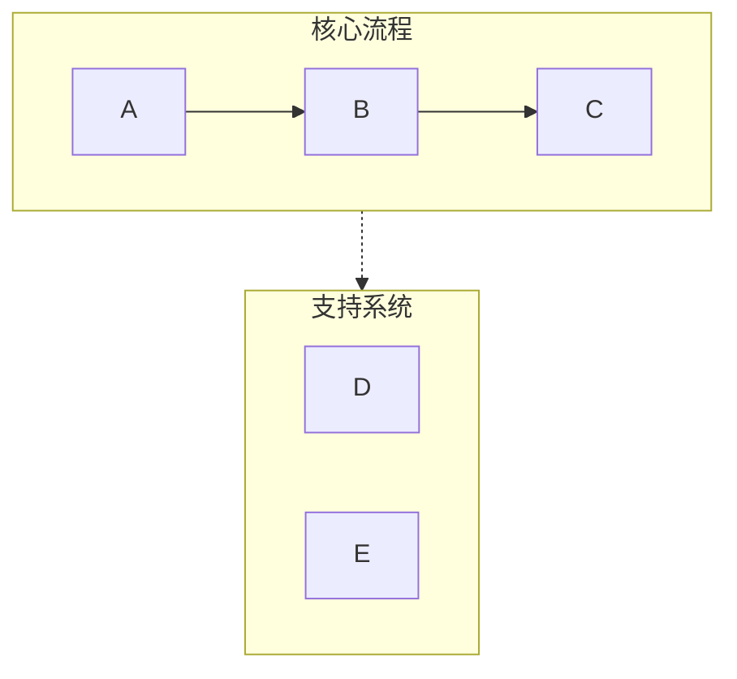
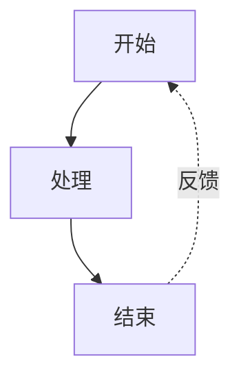
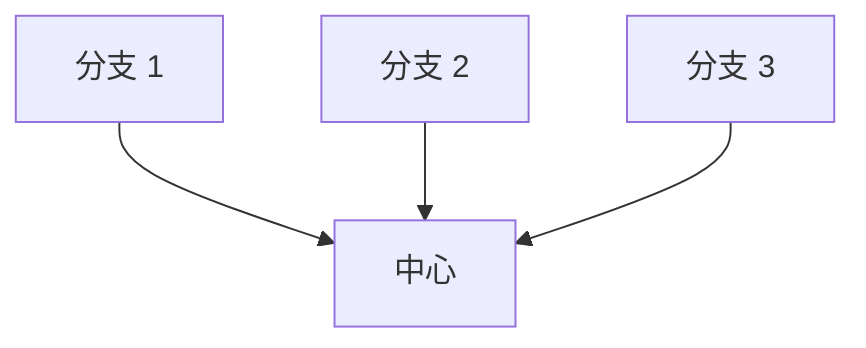

# Mermaid 可视化器

## 适用场景

- 需要将文本描述转换为可视化流程图
- 创建系统架构图、时序图、状态图
- 生成思维导图、对比图表
- 任何需要用图表表达概念、关系或流程的场景

## 快速开始

创建 Mermaid 图表的基本步骤：

1. **分析内容** - 识别关键概念、关系和流程
2. **选择图表类型** - 根据内容选择最适合的可视化方式
3. **选择配置** - 确定布局、详细程度和样式
4. **生成图表** - 创建语法正确的 Mermaid 代码
5. **输出 Markdown** - 用代码块包裹并提供简要说明

**默认假设：**
- 垂直布局（TB），除非要求水平布局
- 中等详细程度（简洁与信息量平衡）
- 专业配色方案，语义化颜色
- 兼容主流渲染器（GitHub、Notion 等）

## 支持的图表类型

### 1. 流程图 (graph TB/LR)
**适用场景：** 工作流、决策树、顺序流程、AI 架构

**使用时机：** 内容描述步骤、阶段或操作序列

**关键特性：**
- 通过 subgraph 实现泳道分组
- 箭头标签表示转换
- 反馈循环和分支
- 颜色编码的阶段

**配置选项：**
- `layout`: "vertical" (TB), "horizontal" (LR)
- `detail`: "simple" (仅核心步骤), "standard" (带描述), "detailed" (带注释)
- `style`: "minimal", "professional", "colorful"

### 2. 循环流程图 (graph TD 循环布局)
**适用场景：** 循环过程、持续改进循环、Agent 反馈系统

**使用时机：** 内容强调迭代、反馈或循环关系

**关键特性：**
- 中心辐射元素
- 曲线反馈箭头
- 清晰的循环指示器

### 3. 对比图 (graph TB 并行路径)
**适用场景：** 前后对比、A 与 B 分析、传统与现代系统对比

**使用时机：** 内容对比两个或多个方法或系统

**关键特性：**
- 并排布局
- 中心对比节点
- 通过颜色/样式清晰区分

### 4. 思维导图 (mindmap)
**适用场景：** 层级概念、知识组织、主题分解

**使用时机：** 内容具有层级关系和清晰的父子关系

**关键特性：**
- 径向树结构
- 多层嵌套
- 清晰的视觉层级

### 5. 时序图 (sequenceDiagram)
**适用场景：** 组件间交互、API 调用、消息流

**使用时机：** 内容涉及参与者/系统随时间的通信

**关键特性：**
- 基于时间线的布局
- 清晰的参与者分隔
- 流程激活框

### 6. 状态图 (stateDiagram-v2)
**适用场景：** 系统状态、状态转换、生命周期阶段

**使用时机：** 内容描述状态及其之间的转换

**关键特性：**
- 清晰的状态节点
- 带标签的转换
- 开始和结束状态

## 关键语法规则

**始终遵循这些规则以防止解析错误：**

### 规则 1：避免列表语法冲突
```
❌ 错误: [1. Perception]       → 触发 "Unsupported markdown: list"
✅ 正确: [1.Perception]         → 移除句号后的空格
✅ 正确: [① Perception]         → 使用圈数字（①②③④⑤⑥⑦⑧⑨⑩）
✅ 正确: [(1) Perception]       → 使用括号
✅ 正确: [Step 1: Perception]   → 使用 "Step" 前缀
```

### 规则 2：子图命名
```
❌ 错误: subgraph AI Agent Core  → 名称中有空格但未使用引号
✅ 正确: subgraph agent["AI Agent Core"]  → 使用 ID + 显示名称
✅ 正确: subgraph agent          → 仅使用简单 ID
```

### 规则 3：节点引用
```
❌ 错误: Title --> AI Agent Core  → 直接引用显示名称
✅ 正确: Title --> agent          → 引用子图 ID
```

### 规则 4：节点文本中的特殊字符
```
✅ 使用引号包裹含空格的文本: ["Text with spaces"]
✅ 转义或避免: 引号 → 使用 『』代替
✅ 转义或避免: 括号 → 使用 「」代替
✅ 圆形节点中的换行: ((Text<br/>Break))
```

### 规则 5：箭头类型
- `-->` 实线箭头
- `-.->` 虚线箭头（用于支持系统、可选路径）
- `==>` 粗箭头（用于强调）
- `~~~` 不可见链接（仅用于布局）

完整语法参考和边界情况，见 [references/syntax-rules.md](references/syntax-rules.md)

## 配置选项

所有图表都接受这些参数：

**布局：**
- `direction`: "vertical" (TB), "horizontal" (LR), "right-to-left" (RL), "bottom-to-top" (BT)
- `aspect`: "portrait" (默认), "landscape" (宽), "square"

**详细程度：**
- `simple`: 仅核心元素，最少标签
- `standard`: 平衡的详细程度，含关键描述（默认）
- `detailed`: 完整注释、说明和元数据
- `presentation`: 为幻灯片优化（更大字体，更少细节）

**样式：**
- `minimal`: 单色，简洁线条
- `professional`: 语义化颜色，清晰层级（默认）
- `colorful`: 鲜艳颜色，高对比度
- `academic`: 用于论文/文档的正式样式

**附加选项：**
- `show_legend`: true/false - 包含颜色/符号图例
- `numbered`: true/false - 为步骤添加序号
- `title`: string - 添加图表标题

## 使用模式示例

**模式 1：基本请求**
```
用户: "可视化软件开发生命周期"
响应: [分析 → 选择 graph TB → 以标准详细程度生成]
```

**模式 2：带配置**
```
用户: "创建我们销售流程的水平流程图，要很详细"
响应: [分析 → 选择 graph LR → 以详细级别生成]
```

**模式 3：对比**
```
用户: "对比传统 AI vs AI Agent"
响应: [分析 → 选择对比布局 → 用对比样式生成]
```

## 工作流

1. **理解内容**
   - 识别主要概念、实体和关系
   - 确定层级或顺序
   - 注意任何对比或差异

2. **选择图表类型**
   - 将内容结构匹配到图表类型
   - 考虑用户的展示场景
   - 如不明确则默认为流程图

3. **选择配置**
   - 应用用户指定的选项
   - 对未指定选项使用合理默认值
   - 优化可读性

4. **生成 Mermaid 代码**
   - 严格遵循所有语法规则
   - 使用语义化命名（描述性 ID）
   - 应用一致的样式
   - 测试常见错误：
     * 节点文本中无 "number. space" 模式
     * 所有子图使用 ID["display name"] 格式
     * 所有节点引用使用 ID 而非显示名称

5. **带上下文输出**
   - 用 ```mermaid 代码块包裹
   - 添加图表结构的简要说明
   - 提及渲染兼容性（GitHub 等）
   - 提供调整或创建变体

## 配色方案

标准专业色板：
- 绿色 (#d3f9d8/#2f9e44): 输入、感知、起始状态
- 红色 (#ffe3e3/#c92a2a): 规划、决策点
- 紫色 (#e5dbff/#5f3dc4): 处理、推理
- 橙色 (#ffe8cc/#d9480f): 动作、工具使用
- 青色 (#c5f6fa/#0c8599): 输出、执行、结果
- 黄色 (#fff4e6/#e67700): 存储、内存、数据
- 粉色 (#f3d9fa/#862e9c): 学习、优化
- 蓝色 (#e7f5ff/#1971c2): 元数据、定义、标题
- 灰色 (#f8f9fa/#868e96): 中性元素、传统系统

## 常见模式

### 泳道模式（分组）


### 反馈循环模式


### 中心辐射模式


## 质量检查清单

输出前验证：
- [ ] 任何节点文本中无 "number. space" 模式
- [ ] 所有子图使用正确 ID 语法
- [ ] 所有箭头使用正确语法（-->, -.->）
- [ ] 颜色应用一致
- [ ] 指定布局方向
- [ ] 存在样式声明
- [ ] 无歧义的节点引用
- [ ] 兼容主流渲染器

## 参考文档

详细语法规则和故障排除，见：
- [references/syntax-rules.md](references/syntax-rules.md) - 完整语法参考和错误预防
