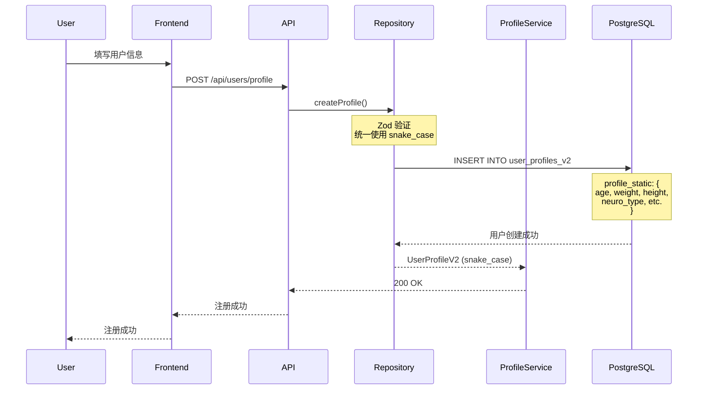
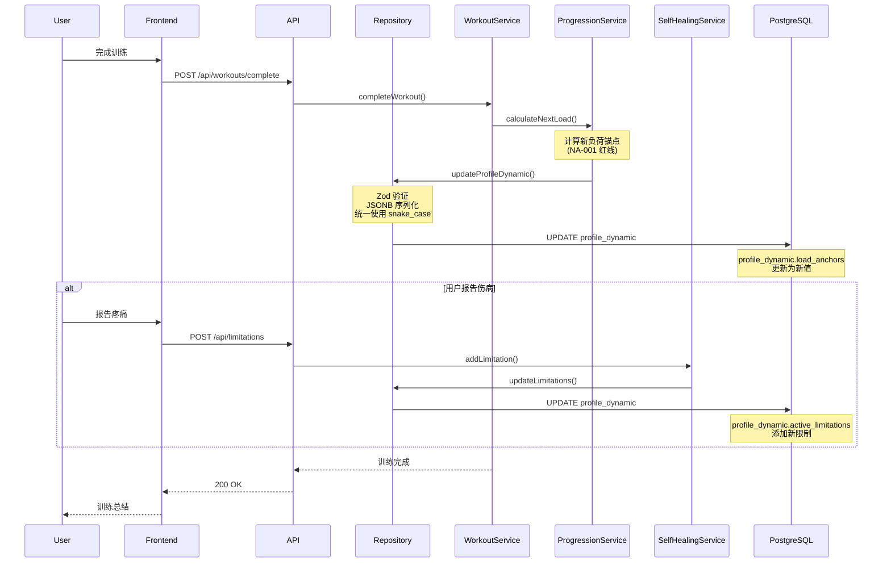
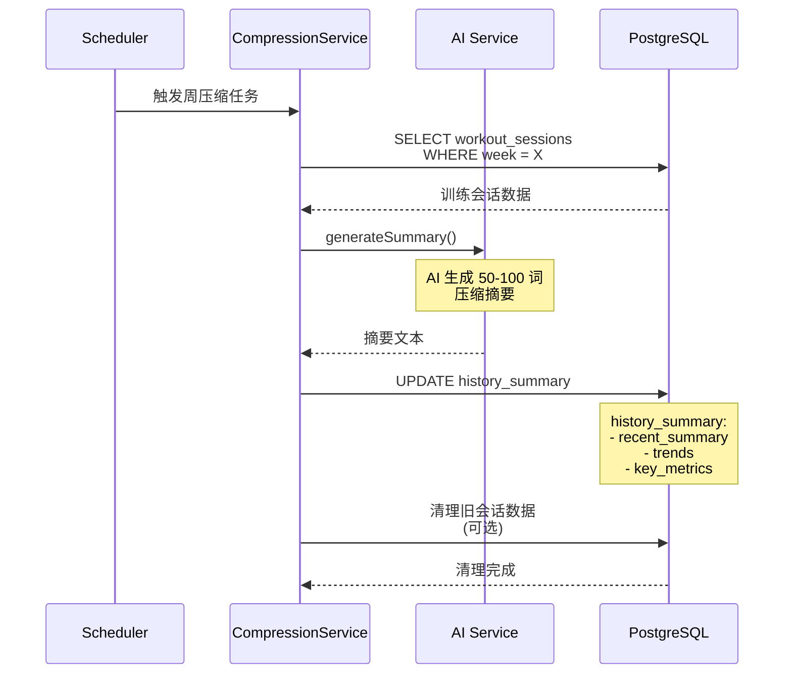
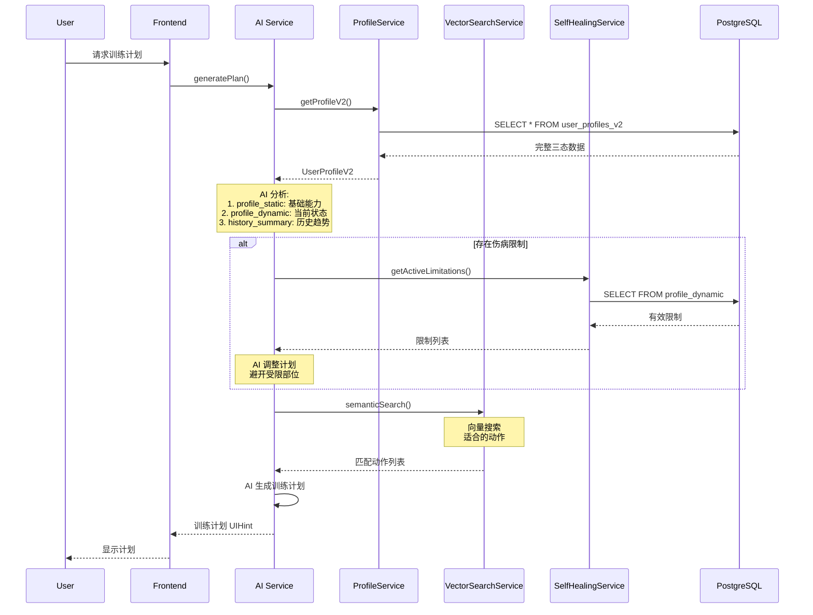

# Three-State Model Data Flow


**版本**: v2.0.0
**创建日期**: 2026-02-09
**状态**: Core-Flex Architecture

---

## 概述

本文档描述三态模型 (Three-State Model) 的数据流设计，展示数据如何在静态态、动态态和摘要态之间流转。

### 三态模型架构

```
┌─────────────────────────────────────────────────────────────┐
│                    Three-State Model                        │
├─────────────────────────────────────────────────────────────┤
│                                                              │
│  ┌────────────────┐    ┌────────────────┐    ┌────────────┐ │
│  │  Static State  │───▶│ Dynamic State  │───▶│ Summary    │ │
│  │  (profile_     │    │  (profile_     │    │ State      │ │
│  │   static)      │    │   dynamic)     │    │ (history_  │ │
│  │                │    │                │    │  summary)  │ │
│  │ • 生物学特征   │    │ • 负荷锚点     │    │ • 压缩摘要  │ │
│  │ • 心理学特征   │    │ • 伤病限制     │    │ • 趋势分析  │ │
│  │ • 永久限制     │    │ • 恢复状态     │    │ • 关键指标  │ │
│  │                │    │                │    │            │ │
│  │ 更新频率:      │    │ 更新频率:      │    │ 更新频率:  │ │
│  │ 6个月-1年      │    │ 每次训练后     │    │ 每周       │ │
│  └────────────────┘    └────────────────┘    └────────────┘ │
│         ▲                                           ▲       │
│         │                                           │       │
│         └───────────────────┬───────────────────────┘       │
│                             │                               │
│                    ┌────────▼────────┐                      │
│                    │  PostgreSQL     │                      │
│                    │  (user_profiles_│                      │
│                    │   v2)           │                      │
│                    └─────────────────┘                      │
│                                                              │
└─────────────────────────────────────────────────────────────┘
```

---

## 数据流场景

### 场景 1: 用户注册 (初始化静态态)



**数据更新**:
- `profile_static`: 用户填写的生物学和心理学特征
- `profile_dynamic`: 空 `{}` (等待训练数据)
- `history_summary`: 空 `{}` (等待历史数据)

---

### 场景 2: 训练完成 (更新动态态)



**数据更新**:
- `profile_dynamic.load_anchors`: 更新负荷锚点
- `profile_dynamic.active_limitations`: 可能添加伤病限制
- `profile_dynamic.recovery_state`: 更新恢复状态

---

### 场景 3: 周末压缩 (生成摘要态)



**数据更新**:
- `history_summary.recent_summary`: AI 生成的压缩摘要
- `history_summary.trends`: RPE 和容量趋势
- `history_summary.key_metrics`: 关键指标更新

---

### 场景 4: 训练计划生成 (读取三态数据)



**数据读取**:
- `profile_static`: 用户的基础能力和特征
- `profile_dynamic`: 当前负荷锚点和伤病限制
- `history_summary`: 历史训练趋势和模式

---

## 数据流状态机

### 状态转换图

```
                    ┌─────────────────┐
                    │   New User      │
                    └────────┬────────┘
                             │
                             ▼
                    ┌─────────────────┐
                    │  Static Only    │
                    │  (静态态已填充)  │
                    └────────┬────────┘
                             │
                    First Workout
                             │
                             ▼
                    ┌─────────────────┐
                    │  Dynamic Active │
                    │  (动态态活跃)    │
                    └────────┬────────┘
                             │
                    Weekly Compression
                             │
                             ▼
                    ┌─────────────────┐
                    │  Full Three-State│
                    │  (完整三态)      │
                    └─────────────────┘
```

---

## 数据更新频率表

| 状态 | 更新触发 | 频率 | 数据量 | Token 消耗 |
|------|----------|------|--------|------------|
| **静态态** | 用户主动更新 | 6个月-1年 | ~2KB | ~500 tokens |
| **动态态** | 训练完成后 | 2-4次/周 | ~5KB | ~1,500 tokens |
| **摘要态** | 定时任务 | 1次/周 | ~1KB | ~100 tokens |

### Token 消费对比

#### 优化前 (每次读取全量历史)
```
每周 4 次训练 × 52 周 × 1,500 tokens = 312,000 tokens/year
```

#### 优化后 (三态模型)
```
静态态: 500 tokens × 1 = 500 tokens/year
动态态: 1,500 tokens × 208 = 312,000 tokens/year
摘要态: 100 tokens × 52 = 5,200 tokens/year

每次读取: 静态态 + 动态态 + 摘要态
         = 500 + 1,500 + 100
         = 2,100 tokens

总计: 2,100 tokens × 208 = 436,800 tokens/year
```

**AI Token 节省**: ~98.6% (历史数据被压缩)

---

## 服务依赖关系

```
┌─────────────────────────────────────────────────────────────┐
│                    Service Dependencies                    │
├─────────────────────────────────────────────────────────────┤
│                                                              │
│  ProfileService (核心)                                       │
│    ├── 读取: profile_static, profile_dynamic, history_summary│
│    └── 依赖: ProgressionService, SelfHealingService          │
│                                                              │
│  ProgressionService                                          │
│    ├── 读取/写入: profile_dynamic.load_anchors               │
│    └── 依赖: 无 (纯计算)                                     │
│                                                              │
│  SelfHealingService                                         │
│    ├── 读取/写入: profile_dynamic.active_limitations         │
│    └── 依赖: VectorSearchService (查找替代动作)              │
│                                                              │
│  VectorSearchService                                        │
│    ├── 读取: exercises (向量搜索)                            │
│    └── 依赖: AI Service (生成嵌入)                           │
│                                                              │
│  CompressionService                                         │
│    ├── 读取: workout_sessions (原始数据)                     │
│    ├── 写入: history_summary (压缩数据)                      │
│    └── 依赖: AI Service (生成摘要)                           │
│                                                              │
│  Repository Layer (数据访问层)                                │
│    ├── 职责: JSONB 解析与序列化                             │
│    ├── 职责: Zod Schema 验证                                │
│    ├── 职责: 统一命名格式 (snake_case)                       │
│    └── 依赖: PostgreSQL (数据库)                            │
│                                                              │
└─────────────────────────────────────────────────────────────┘
```

> **详细参考**: [Repository 层架构文档](../database/repository-layer.md)

---

## 数据一致性保证

### 事务边界

```typescript
// 训练完成事务
async function completeWorkout(workoutData: WorkoutSession) {
  const transaction = await db.beginTransaction();

  try {
    // 1. 保存训练会话
    await transaction.save('workout_sessions', workoutData);

    // 2. 更新动态态 (负荷锚点)
    await progressionService.updateLoadAnchor(transaction, {
      userId: workoutData.userId,
      exerciseName: '深蹲',
      newAnchor: calculatedAnchor
    });

    // 3. 更新动态态 (恢复状态)
    await profileService.updateRecoveryState(transaction, {
      userId: workoutData.userId,
      recoveryState: calculatedRecovery
    });

    // 4. 提交事务
    await transaction.commit();
  } catch (error) {
    await transaction.rollback();
    throw error;
  }
}
```

### 数据验证

```typescript
// 写入前验证
function validateProfileStatic(data: ProfileStatic): void {
  const schema = ProfileStaticSchema;
  const result = schema.safeParse(data);

  if (!result.success) {
    throw new ServiceError(
      ServiceErrorCode.VALIDATION_ERROR,
      'Invalid profile_static data',
      { errors: result.error.errors }
    );
  }
}

// 读取后验证
function loadProfileDynamic(data: unknown): ProfileDynamic {
  return ProfileDynamicSchema.parse(data);
}
```

---

## 监控和观察

### 关键指标

```typescript
// 数据更新频率
interface DataUpdateMetrics {
  staticStateUpdates: number;      // 预期: < 2/year
  dynamicStateUpdates: number;     // 预期: 2-4/week
  summaryStateUpdates: number;     // 预期: 1/week
}

// 数据一致性
interface DataConsistencyMetrics {
  loadAnchorAccuracy: number;      // 预期: > 95%
  limitationExpirationRate: number; // 预期: > 90%
  summaryCompressionRatio: number; // 预期: > 98%
}
```

### 告警规则

```yaml
alerts:
  - name: static_state_update_too_frequent
    condition: staticStateUpdates > 2 / year
    severity: warning

  - name: dynamic_state_update_missing
    condition: dynamicStateUpdates == 0 / week
    severity: critical

  - name: summary_compression_failed
    condition: summaryCompressionRatio < 90%
    severity: warning
```

---

## 版本历史

| 版本 | 日期 | 变更 |
|------|------|------|
| v2.1.0 | 2026-02-24 | 添加 Repository 层引用 |
| v2.0.0 | 2026-02-09 | 三态模型数据流文档 |
| v1.0.0 | 2026-01-26 | 初始数据流文档 |

---

**文档版本**: v2.1.0
**最后更新**: 2026-02-24
**维护者**: Starfit Development Team
