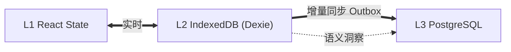

# 数据协议

**状态**: 与源码对齐（2026-09 重写）

---

本文档概览 Starfit 的前后端数据契约。**真源是代码**：

- 数据契约唯一定义源：`shared/contracts/index.ts`（Zod Schema + 类型推导，扁平导出）
- 校验工具：`shared/contracts/validation.ts`（`parseJSONSafe` / `validateOrThrow` 等）
- 按领域拆分的子模块：`shared/contracts/database/`、`logging/`、`mapping/`

> 历史上的 `backend/src/types/shared.ts` 与 `shared/v2/types/protocol.ts` 已被
> `shared/contracts` 取代；引用旧路径的文档均属过期内容。

## 核心原则

1. **单一真源**：所有跨端类型只在 `shared/contracts` 定义一次，前端后端从这里 import
2. **Zod 运行时校验**：每个 Schema 都有运行时验证，类型经 `z.infer` 推导
3. **JSON 解析必须走 `parseJSONSafe()`**：禁止裸 `JSON.parse` 处理外部数据
4. **snake_case**：数据库层与应用层统一命名，避免字段名转换层

## 契约分区（index.ts 内的主要段落）

| 分区 | 代表 Schema | 用途 |
| --- | --- | --- |
| 负荷锚点（LoadAnchor） | `HeartRateAnchorSchema` / `ResistanceAnchorSchema` / `CardioAnchorSchema` / `LoadAnchorSchema` / `LoadAnchorsSchema` | 力量/有氧/心率锚点，动作类型字段校验 `validateAnchorForExerciseType` |
| 用户画像 | `BasicInfoSchema` / `PreferencesSchema` / `PhysiologicalSchema` / `PsychologicalSchema` / `PsychoOSSchema` / `HRBaselineSchema` | 三态模型中的画像态 |
| 限制项管理 | `ActiveLimitation` 相关 + `filterExpiredLimitations` / `calculateExpirationTime` | 伤病/限制的时效过滤 |
| 协议状态 | `ProtocolStatusSchema` | 训练协议生命周期 |
| 建议 | `shared/contracts/suggestions.ts` | 动作建议（off / hybrid 模式）的进出契约 |
| 校验工具 | `validation.ts` 重导出 | `parseJSONSafe`、`validateBatch`、`ValidationError` 等 |

完整的类型清单请直接读 `shared/contracts/index.ts`（扁平导出，一屏可概览），
或生成页面 [共享类型](/api/shared-types)。

## Agent 场景枚举（snake_case）

`chat` / `plan` / `summary` / `tutorial` / `workout_complete` / `update_profile` / `unknown`（防御性占位）。

## 存储分层与协议的关系

- **L3 契约**：以上 Zod Schema 即数据库行/请求体的形状
- **L2 Outbox**：离线操作入队、网络恢复重放，契约不变
- 同步端点：`POST /api/sync/push`、`GET /api/sync/pull`

## 更多

- [共享类型](/api/shared-types) — 契约导出清单
- [Repository 层](/database/repository-layer.md) — 数据访问边界
- [PostgreSQL Schema](/database/postgresql-schema.md) — 表结构
