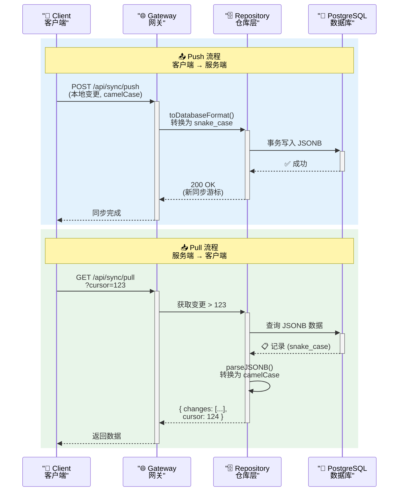

# 同步系统

> 注：旧的 WebSocket 实时进度通道已移除，Chat 统一为 SSE 流式；本文描述**离线数据同步**（双轨同步、动作库缓存、Outbox）。
>
> 待 req-plan 复核：同步触发的实时通知机制在新架构下如何实现（多设备 `sync_needed` 之类的事件是否保留、改用何种通道）。

**版本**: v2.0.0
**创建日期**: 2026-01-16
**最后更新**: 2026-02-24
**状态**: 生产就绪

---

Starfit 采用 **双轨 (Dual-Track)** 同步策略，以弥合离线优先的移动体验与基于云的分析之间的差距。

> **架构说明**: 本文档描述的同步系统基于 PostgreSQL 数据库和 Repository 层架构。详见 [Repository 层架构文档](../database/repository-layer.md)。

## 双轨理念

### 1. 硬轨道 (结构化数据)
- **数据类型**: 训练日志、组数、次数、重量、动作。
- **事实来源**: 后端 PostgreSQL 数据库。
- **存储格式**: JSONB (PostgreSQL 原生 JSON 二进制格式，支持索引和查询)
- **同步方式**: 增量同步 (Push/Pull)。
- **访问层**: Repository 层负责 camelCase ↔ snake_case 转换和 JSONB 解析
- **冲突解决**: 服务器优先 (基于时间戳)。

### 2. 软轨道 (非结构化上下文)
- **数据类型**: 聊天记录、用户感受、日志条目、"氛围"。
- **事实来源**: 分布式 (向量数据库 + 本地存储)。
- **同步方式**: 事件流。
- **目标**: 为 AI 提供上下文，一致性不如可用性重要。

## 动作库缓存

### 缓存策略
动作库采用 **L2 优先，L3 降级** 的缓存策略，确保离线状态下仍可使用：

- **L2 缓存 (IndexedDB)**: 优先读取本地缓存
- **L3 源 (后端 API)**: 缓存失效时从服务器拉取
- **自动同步**: 应用启动时、网络恢复时、定期（24 小时）自动同步

### 缓存结构
```typescript
interface ExerciseLibraryCache {
  exercises: Exercise[];
  meta: {
    version: number;
    lastSyncTime: number;
    hash: string;
    count: number;
  };
}
```

### 同步流程
1. **首次加载**: 从后端 `/api/exercises` 获取完整动作库
2. **后续加载**: 优先使用本地缓存，检查版本和过期时间
3. **增量同步**: 通过 `/api/sync/pull` 获取更新的动作（基于 `modified_at`）
4. **冲突解决**: 服务器数据优先，本地合并时覆盖同 ID 动作

### 离线场景
- **在线 → 离线**: 使用本地缓存，正常浏览和搜索动作库
- **离线 → 在线**: 自动触发同步，合并服务器更新
- **无缓存离线**: 显示离线提示，引导用户连接网络
- **新增动作**: 暂存到本地队列，网络恢复后同步到服务器

---

## Repository 层集成

Repository 层在同步系统中扮演关键角色，负责数据格式转换和 JSONB 处理：

### 格式转换流程
```
前端 (camelCase)
    ↓
API 层 (camelCase)
    ↓
Repository 层 (转换边界)
    ├─ toDatabaseFormat(): camelCase → snake_case
    ├─ parseJSONB(): JSONB 自动反序列化
    └─ stringifyJSONB(): 数据序列化为 JSONB
    ↓
PostgreSQL (snake_case + JSONB)
```

### JSONB 字段处理
- **读取**: PostgreSQL `pg` 驱动自动将 JSONB 反序列化为 JavaScript 对象
- **写入**: Repository 层将对象序列化为 JSONB 格式存储
- **验证**: 使用 Zod Schema 验证 JSONB 数据完整性
- **向后兼容**: 支持 SQLite 迁移遗留的 JSON 字符串格式

### 关键方法
```typescript
// Repository 层提供的核心方法
class BaseRepository {
  // 解析 JSONB 数据 (处理对象、字符串、null)
  protected parseJSONB<T>(data: unknown, schema: z.ZodType<T>): T

  // 序列化为 JSONB 字符串
  protected stringifyJSONB(data: unknown): string

  // 查询转换 (自动 snake_case ↔ camelCase)
  protected async queryOne<T>(sql: string, params: object): Promise<T>
  protected async queryMany<T>(sql: string, params: object): Promise<T[]>
}
```

**详细参考**: [Repository 层架构文档](../database/repository-layer.md)

---

## 同步流程



## 离线处理
客户端使用 **Dexie** (或类似本地 DB) 在离线时排队变更。
1. 用户记录一组训练 (离线) -> 保存到本地 DB。
2. 网络恢复。
3. 同步 Worker 唤醒。
4. 推送排队的变更到 `/api/sync/push`。
5. 从 `/api/sync/pull` 拉取最新状态。

---

## 版本历史

| 版本 | 日期 | 变更 |
|------|------|------|
| v2.0.0 | 2026-02-24 | PostgreSQL 迁移，添加 Repository 层说明，更新 JSONB 格式 |
| v1.0.0 | 2026-01-16 | 初始同步系统文档 |

---

**文档版本**: v2.0.0
**最后更新**: 2026-02-24
**维护者**: Starfit Development Team
