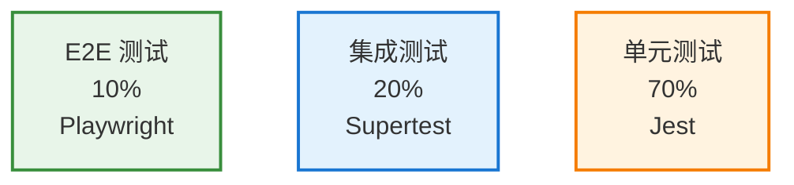

# 代码质量与测试

## 概述

本文档介绍 Starfit 项目的代码质量保障体系、测试策略和开发规范。

## 测试金字塔



### 单元测试 (70%)

**目标**: 测试独立函数、工具类、服务方法

**位置**: `backend/tests/unit/`

**示例**:
```typescript
describe('UserProfileService', () => {
  it('should return user profile when exists', async () => {
    const profile = await userProfileService.getProfile('test-user');
    expect(profile).toBeDefined();
    expect(profile.user_id).toBe('test-user');
  });

  it('should throw error when user does not exist', async () => {
    await expect(
      userProfileService.getProfile('non-existent')
    ).rejects.toThrow(NotFoundError);
  });
});
```

### 集成测试 (20%)

**目标**: 测试 API 端点、数据库操作、组件集成

**位置**: `backend/tests/integration/`

**示例**:
```typescript
describe('API Integration', () => {
  it('should update user profile', async () => {
    const response = await request(app)
      .put('/api/profiles/test-user')
      .send({ basic_info: { age: 30 } });
    
    expect(response.status).toBe(200);
    expect(response.body.success).toBe(true);
  });
});
```

### E2E 测试 (10%)

**目标**: 测试完整用户流程、跨浏览器验证

**位置**: `e2e/specs/` 和 `backend/tests/e2e/`

**示例**:
```typescript
test('should save user profile from UI', async ({ page }) => {
  await page.goto('/admin/users');
  await page.click('button:has-text("Edit")');
  await page.fill('[name="age"]', '35');
  await page.click('button:has-text("保存")');
  
  // Verify database
  const profile = await getProfile('test-user');
  expect(profile.age).toBe(35);
});
```

## 代码规范

### TypeScript 配置

项目使用 TypeScript 严格模式:

```json
{
  "compilerOptions": {
    "strict": true,
    "noUnusedLocals": true,
    "noUnusedParameters": true,
    "noImplicitReturns": true,
    "noFallthroughCasesInSwitch": true
  }
}
```

### 命名约定

| 类型 | 约定 | 示例 |
|------|------|------|
| 文件 | kebab-case | `user-profile-service.ts` |
| 组件 | PascalCase | `UserProfileDashboard.tsx` |
| 函数 | camelCase | `getUserProfile` |
| 常量 | UPPER_SNAKE_CASE | `MAX_RETRY_COUNT` |
| 接口 | PascalCase | `UserProfile` |
| 类型 | PascalCase | `UserProfileType` |

### ESLint 规则

关键规则:
```json
{
  "rules": {
    "@typescript-eslint/no-unused-vars": "error",
    "@typescript-eslint/no-floating-promises": "error",
    "@typescript-eslint/no-misused-promises": "error",
    "no-console": ["warn", { "allow": ["warn", "error"] }]
  }
}
```

## 错误处理

### 自定义错误类

```typescript
export class AppError extends Error {
  constructor(
    message: string,
    public code: string,
    public statusCode: number = 500,
    public context?: any
  ) {
    super(message);
    this.name = this.constructor.name;
  }
}

export class ValidationError extends AppError {
  constructor(message: string, field?: string, context?: any) {
    super(message, 'VALIDATION_ERROR', 400, { field, ...context });
  }
}

export class NotFoundError extends AppError {
  constructor(message: string, context?: any) {
    super(message, 'NOT_FOUND', 404, context);
  }
}
```

### 错误处理中间件

```typescript
export async function errorHandler(
  error: Error,
  req: FastifyRequest,
  reply: FastifyReply
) {
  const requestId = (req as any).requestId || 'unknown';
  
  logger.error('Request failed', error, { requestId });
  
  if (error instanceof AppError) {
    return reply.status(error.statusCode).send({
      success: false,
      error: {
        code: error.code,
        message: error.message,
        requestId
      }
    });
  }
  
  return reply.status(500).send({
    success: false,
    error: {
      code: 'INTERNAL_ERROR',
      message: '服务器内部错误',
      requestId
    }
  });
}
```

## 日志系统

### 结构化日志

使用 Pino 进行结构化日志记录:

```typescript
import logger from './utils/logger';

logger.info('用户画像更新', {
  userId: 'test-user',
  fields: ['age', 'weight'],
  requestId: 'abc-123'
});

logger.error('数据库操作失败', error, {
  operation: 'UPDATE',
  table: 'user_insights',
  userId: 'test-user'
});
```

### 请求追踪

使用请求追踪中间件:

```typescript
app.register(requestTracker, {
  enabled: true,
  logHeaders: false,
  logQuery: false
});
```

## 数据库操作

### 安全的数据库操作

使用 DatabaseClient 进行安全操作:

```typescript
import { dbClient } from './db/databaseClient';

// Execute query with error handling
const result = dbClient.execute(
  'UPDATE user_insights SET basic_info = ? WHERE user_id = ?',
  [JSON.stringify(basicInfo), userId],
  { operation: 'UPDATE_USER_PROFILE' }
);

if (result.changes === 0) {
  logger.warn('UPDATE 未影响任何行', { userId });
}
```

### 事务支持

```typescript
dbClient.transaction((db) => {
  db.prepare('UPDATE profiles SET age = ? WHERE user_id = ?').run([30, userId]);
  db.prepare('INSERT INTO logs (user_id, action) VALUES (?, ?)').run([userId, 'UPDATE']);
});
```

## 代码审查流程

### Pull Request 模板

每个 PR 应包含:

1. **变更类型**: feature / bugfix / refactor / docs
2. **变更描述**: 详细说明做了什么修改
3. **测试状态**: 
   - [ ] 单元测试通过
   - [ ] 集成测试通过
   - [ ] E2E 测试通过
4. **代码质量检查**:
   - [ ] ESLint 通过
   - [ ] TypeScript 类型检查通过
   - [ ] 覆盖率达标
5. **破坏性变更**: 是否有不兼容的变更
6. **部署检查**: 是否需要数据库迁移

### 审查清单

#### 代码质量
- [ ] 代码遵循项目规范
- [ ] 命名清晰且有意义
- [ ] 函数职责单一
- [ ] 无重复代码
- [ ] 适当的错误处理

#### 功能性
- [ ] 实现了需求
- [ ] 边界情况处理
- [ ] 性能考虑
- [ ] 安全性检查

#### 测试
- [ ] 单元测试覆盖
- [ ] 集成测试覆盖
- [ ] E2E 测试覆盖关键路径

#### 文档
- [ ] API 文档更新
- [ ] 代码注释充分
- [ ] README 更新

## CI/CD 流程

### GitHub Actions

项目使用 GitHub Actions 进行自动化检查:

#### CI 工作流

```yaml
name: CI

on:
  push:
    branches: [main, develop]
  pull_request:
    branches: [main, develop]

jobs:
  lint:
    runs-on: ubuntu-latest
    steps:
      - uses: actions/checkout@v3
      - run: npm ci
      - run: npm run lint

  test:
    runs-on: ubuntu-latest
    steps:
      - uses: actions/checkout@v3
      - run: npm ci
      - run: npm run test

  e2e:
    runs-on: ubuntu-latest
    steps:
      - uses: actions/checkout@v3
      - run: npm ci
      - run: npm run test:e2e
```

#### 质量门禁

```yaml
name: Quality Gate

on:
  pull_request:
    branches: [main]

jobs:
  quality-check:
    runs-on: ubuntu-latest
    steps:
      - uses: actions/checkout@v3
      - run: npm ci
      - run: npm run lint
      - run: npm run typecheck
      - run: npm run test:coverage
```

## 性能优化

### 数据库索引

为频繁查询的列添加索引:

```sql
CREATE INDEX idx_user_id ON user_insights(user_id);
CREATE INDEX idx_created_at ON user_insights(created_at);
```

### 缓存策略

```typescript
const cache = new Map<string, { data: any, timestamp: number }>();

export async function getProfileWithCache(userId: string) {
  const cached = cache.get(userId);
  if (cached && Date.now() - cached.timestamp < 60000) {
    return cached.data;
  }

  const profile = await userProfileService.getProfile(userId);
  cache.set(userId, { data: profile, timestamp: Date.now() });
  return profile;
}
```

### 防抖

```typescript
import { debounce } from 'lodash';

const debouncedSave = debounce(async (data: UserProfile) => {
  await api.put(`/profiles/${data.user_id}`, data);
}, 500);
```

## 监控与可观测性

### 健康检查

- `GET /health` - 系统整体健康
- `GET /health/ready` - 就绪检查
- `GET /health/live` - 存活检查

### 性能监控

使用 Sentry 进行错误追踪和性能监控:

```typescript
export function initSentry(options: SentryOptions): void {
  Sentry.init({
    dsn: options.dsn,
    environment: options.environment,
    tracesSampleRate: 0.1,
    beforeSend(event) {
      delete event.request.headers?.['authorization'];
      return event;
    }
  });
}
```

## 最佳实践

### 安全性

1. 永不提交密钥或 API 令牌
2. 验证所有用户输入
3. 使用参数化查询
4. 清理用户生成的内容
5. 实现速率限制
6. 生产环境使用 HTTPS

### 代码质量

1. 编写自文档化的代码
2. 保持函数小而专注
3. 遵循 DRY 原则
4. 使用有意义的变量名
5. 添加类型定义
6. 为新功能编写测试

### Git 工作流

1. 使用特性分支
2. 编写描述性的提交信息
3. 合并相关提交
4. 创建 PR 进行审查
5. 更新文档

## 调试技巧

### 后端调试

```typescript
// 添加调试日志
logger.debug('处理请求', { 
  endpoint: '/api/profiles/:userId',
  method: 'PUT',
  userId 
});

// 检查数据库状态
const rows = db.prepare('SELECT * FROM user_insights WHERE user_id = ?').all([userId]);
logger.debug('数据库状态', { count: rows.length, rows });
```

### 前端调试

```typescript
// 使用 React DevTools
// 添加 console.log
console.log('画像已加载', profile);

// 使用浏览器调试器
debugger;
```

## 常见问题排查

### 端口已被占用

```bash
# 查找占用端口的进程
netstat -ano | findstr :43111

# 终止进程
taskkill /PID <pid> /F
```

### 数据库锁定

```bash
# 关闭所有数据库连接
# 检查是否有多个后端实例
```

### TypeScript 错误

```bash
# 运行类型检查
npm run typecheck

# 清除缓存
rm -rf node_modules/.cache
```

### 测试失败

```bash
# 使用详细输出运行测试
npm run test -- --verbose

# 运行特定测试文件
npm run test -- userProfileService.test.ts
```

## 覆盖率目标

| 指标 | 目标 | 当前 |
|------|------|------|
| 分支覆盖率 | 70% | - |
| 函数覆盖率 | 70% | - |
| 行覆盖率 | 70% | - |
| 语句覆盖率 | 70% | - |

运行覆盖率报告:

```bash
npm run test:coverage
```

---

**文档版本**: v2.0.0  
**最后更新**: 2026-01-17
